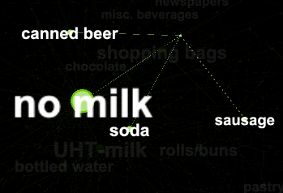

```{r setup, include=FALSE}
knitr::opts_chunk$set(echo = FALSE)
```

```{r load, include=FALSE}
library(here)

path <- here()

load(file = file.path(path, 'output', 'tabs_figs', 'wine_tabsNfigs.RData'))
load(file = file.path(path, 'output', 'tabs_figs', 'arules_tabsNfigs.RData'))

```

## Problem 1 - WinePCA

After centering and re-scaling the data, I ran a for loop to generate an elbow plot so I could determine which k I should use to define my clusters.

```{r, include=FALSE}
plot(SSE_grid)

```
```{r, include=FALSE}
q1_sulfur_plot
```
```{r, include=FALSE}
plot(wine_PCA)
```
```{r, include=FALSE}
q1_color_plot
```

```{r, include=FALSE}
qplot(PC2, PC1, data=wine_PCLuster, color=factor(quality), shape=factor(clusterID))
```


```{r, include=FALSE}
ggplot(PCA_Scores) +
  geom_col(aes(x=reorder(Category,PC1), y=PC1)) +
  coord_flip()
```
```{r, include=FALSE}
q1_PC2_plot = ggplot(PCA_Scores) +
  geom_col(aes(x=reorder(Category,PC2), y=PC2)) +
  coord_flip()
```

```{r, include=FALSE}
q1_cluster_counts_table = wine_PCLuster %>%
  group_by(clusterID, color) %>%
  summarise(count = n(), 
            PC1 = mean(PC1), 
            PC2 = mean(PC2),
            avg_qual = mean(quality)) 
```


## Problem 3 - GrocRules

After pre-processing the groceries data, I feed the list of items and carts to the `apriori` function in `arules`. After a bit of trial and error, I decided to use the following parameters: `support = 0.0012`, `confidence = 0.8`, and `maxlen = 10`. I decided to decrease the support threshold because a high support requirement was not returning interesting associations. I increase the confidence threshold in order to filter out weaker associations, and my max length is set at 10 because I did not want length to be a binding constraint. I wanted to see all rules that meet my support and confidence threshold, regardless of length. 

```{r arules_figures, include = TRUE}
conf_sup
lift_sup
twokey
```

The following table lists the 10 rules with highest lift values. Recall that lift is a measure of how much the probability of observing the LHS increases when we condition on the RHS. The rule with the highest lift associates buying liquor and wine with buying bottled beer, which makes a lot of sense

```{r lift, include = TRUE}
high_lift
```

The next table lists the 10 rules with the highest support values and arranges them by confidence. Recall that confidence is the ratio between the support of LHS and RHS together and the support of the LHS alone. Not many of these rules are interesting because most of them simply associate popular items such as `whole milk` and `other vegetables` with other basic grocery bundles. In fact, most of the rules found here are not interesting for the same reason: they are simply associating commonly purchased grocery bundles. 

```{r conf, include = TRUE}
high_conf
```

Any interesting associations found in this data are obscured by a select few popular items being purchased with in the majority of carts. This is clear from the following network graph of these association rules. 


I want to investigate those carts that do not include these popular items. To do this, I create a tag called `no milk` which I apply to those carts that do not contain `whole milk`. This tag will bring to the surface associations that were otherwise obscured by the strong association between `whole milk` and most carts. The following network graphs show the results. 


 


  


The following tables clearly show the same trend that the above graphs illustrate: items associated with the "no milk" tag tend to be snacks, alcohol, and other items that a non-grocery shopper might run into the store and buy while the "whole milk" is associated with basic, everyday grocery staples. 

```{r nomilk, include = TRUE}
nomilk_tab
milk_tab
```