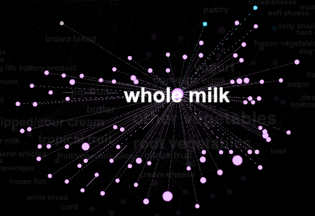
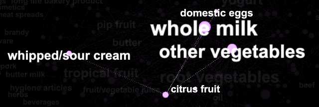

```{r setup, include=FALSE}
knitr::opts_chunk$set(echo = FALSE)
```

```{r load, include=FALSE}
# owning:
library(here)
library(tidyverse)
library(foreach)
library(arules)
library(arulesViz)
library(ggplot2)
library(LICORS)  # for kmeans++
library(foreach)
library(mosaic)
library(foreach)
library(iterators)
library(knitr)


path <- here()

load(file = file.path(path, 'output', 'tabs_figs', 'wine_tabsNfigs.RData'))
load(file = file.path(path, 'output', 'tabs_figs', 'arules_tabsNfigs.RData'))

```

## Problem 1 - WinePCA

After centering and re-scaling the data, I ran a for loop to generate an elbow plot so I could determine which k I should use to define my clusters.

```{r, include=TRUE}
plot(SSE_grid)
```

I tried several k values and settled on 7 after comparing how well the clusters could designate red vs white wine.

```{r, include=TRUE}
q1_sulfur_plot
```

After trying out various parameters for preliminary visualization, I found that the data points separated the most with total.sulfur.dioxide and free.sulfur.dioxide parameters. These properties will later be shown to be the most crucial aspects in the principal component definitions.

```{r, include=TRUE}
plot(wine_PCA)
```
The PCA for this data was able to explain the vast majority of the information with a single dimension. I elected to choose 2 for since there are two distinct types of wine in the data set and for visualization purposes.


```{r, include=TRUE}
q1_color_plot
```
When graphing the principal components on one another, there is a clear separation in the two colors of wine. Specifically, reds appear to have low magnitudes of PC1 and PC2 and whites appear to have high magnitudes of PC1 and PC2.

```{r, include=TRUE}
qplot(PC2, PC1, data=wine_PCLuster, color=factor(quality), shape=factor(clusterID))
```
The quality ratings were more difficult to visualize as they relate to the clusters due to the number of features. What is noticeable is that quality does not appear to be associated with either of the principal components, but is rather spread out through the data in the 5-6 range. We will return to this fact at the final table.

```{r, include=TRUE}
ggplot(PCA_Scores) +
  geom_col(aes(x=reorder(Category,PC1), y=PC1)) +
  coord_flip()
```
As state prior, the dominant force in the principal components was the sulfur content. In PC1 total.sulfur.dioxide stood out as the classifying feature from free.sulfur dioxide by several orders of magnitude.

```{r, include=TRUE}
ggplot(PCA_Scores) +
  geom_col(aes(x=reorder(Category,PC2), y=PC2)) +
  coord_flip()
```
PC2 is defined by free.sulfur.dioxide as well as a lack of total.sulfur.dioxide, the main feature of PC1.

```{r, include=TRUE}
q1_cluster_counts_table
```

This table presents the noise in the data in a much more manageable way. What becomes immediately apparent is the clusters ability to determine which color a type of wine is. Cluster 2 is overwhelmingly white, while cluster 4 is decidedly red. It's also clear that red wines are tend to have large negative values or small positive values for PC1 while white tend to have large positive values or low negative values for PC1, indicating that the main difference between red and white wine is the total.sulfur.dioxide present.

The average quality for each color/cluster demonstrates a disconnect between the chemical contents of the wine and it's subjective score. While there is some variance between the clusters the range between the highest rated color/cluster does not exceed 2 scores of quality. These results could indicate that wine quality is not determined by chemical content. It could also mean that while vast differences in quality are easily identifiable, what separates a wine with score of 8 verses a score of 9 in terms of quality is negligible enough to be come obscured over successive tastings.


## Problem 3 - GrocRules

After pre-processing the groceries data, I feed the list of items and carts to the `apriori` function in `arules`. After a bit of trial and error, I decided to use the following parameters: `support = 0.0012`, `confidence = 0.8`, and `maxlen = 10`. I decided to decrease the support threshold because a high support requirement was not returning interesting associations. I increase the confidence threshold in order to filter out weaker associations, and my max length is set at 10 because I did not want length to be a binding constraint. I wanted to see all rules that meet my support and confidence threshold, regardless of length. 

```{r arules_figures, include = TRUE}
conf_sup
lift_sup
twokey
```

The following table lists the 10 rules with highest lift values. Recall that lift is a measure of how much the probability of observing the LHS increases when we condition on the RHS. The rule with the highest lift associates buying liquor and wine with buying bottled beer, which makes a lot of sense

```{r lift, include = TRUE}
high_lift
```

The next table lists the 10 rules with the highest support values and arranges them by confidence. Recall that confidence is the ratio between the support of LHS and RHS together and the support of the LHS alone. Not many of these rules are interesting because most of them simply associate popular items such as `whole milk` and `other vegetables` with other basic grocery bundles. In fact, most of the rules found here are not interesting for the same reason: they are simply associating commonly purchased grocery bundles. 

```{r conf, include = TRUE}
high_conf
```

Any interesting associations found in this data are obscured by a select few popular items being purchased with in the majority of carts. This is clear from the following network graph of these association rules. 


I want to investigate those carts that do not include these popular items. To do this, I create a tag called `no milk` which I apply to those carts that do not contain `whole milk`. This tag will bring to the surface associations that were otherwise obscured by the strong association between `whole milk` and most carts. The following network graphs show the results. 


 



  



The following tables clearly show the same trend that the above graphs illustrate: items associated with the "no milk" tag tend to be snacks, alcohol, and other items that a non-grocery shopper might run into the store and buy while the "whole milk" is associated with basic, everyday grocery staples. 

```{r nomilk, include = TRUE}
nomilk_tab
milk_tab
```