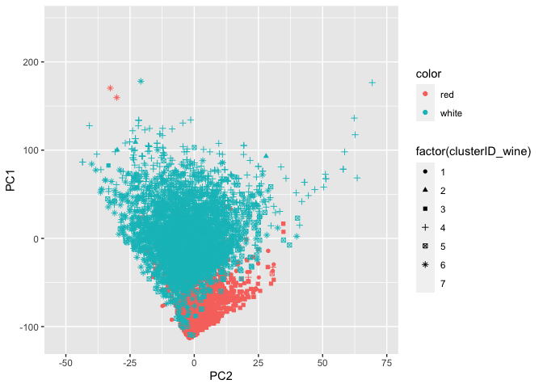
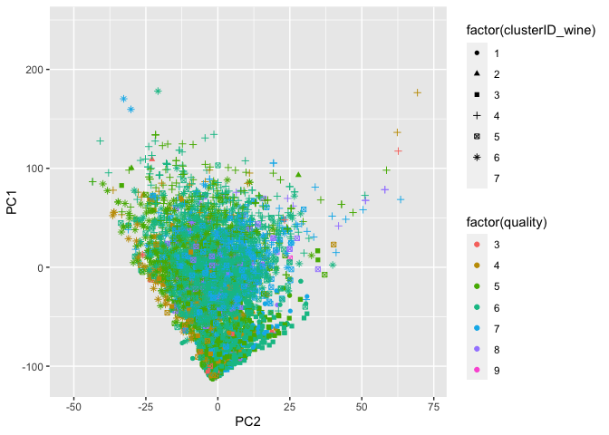
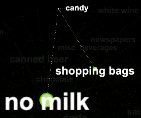

## Problem 1 - WinePCA

After centering and re-scaling the data, I ran a for loop to generate an
elbow plot so I could determine which k I should use to define my
clusters.

I tried several k values and settled on 7 after comparing how well the
clusters could designate red vs white wine.

After trying out various parameters for preliminary visualization, I
found that the data points separated the most with total.sulfur.dioxide
and free.sulfur.dioxide parameters. These properties will later be shown
to be the most crucial aspects in the principal component definitions.

The PCA for this data was able to explain the vast majority of the
information with a single dimension. I elected to choose 2 since there
are two distinct types of wine in the data set and for visualization
purposes.

When graphing the principal components on one another, there is a clear
separation in the two colors of wine. Specifically, reds appear to have
low magnitudes of PC1 and PC2 and whites appear to have higher
magnitudes of PC1 and PC2.

    ## Warning: The shape palette can deal with a maximum of 6 discrete values because
    ## more than 6 becomes difficult to discriminate; you have 7. Consider
    ## specifying shapes manually if you must have them.

    ## Warning: Removed 1469 rows containing missing values (geom_point).

The quality ratings were more difficult to visualize as they relate to
the clusters due to the number of values in the features. What is
noticeable is that quality does not appear to be associated with either
of the principal components, but is rather spread out through the data
in the 5-6 range. We will return to this fact at the final table.

As state prior, the dominant force in the principal components was the
sulfur content. In PC1 total.sulfur.dioxide stood out as the classifying
feature from free.sulfur dioxide by several orders of magnitude.

PC2 is defined by free.sulfur.dioxide as well as a lack of
total.sulfur.dioxide, the main feature of PC1.

<table>
<caption>Color/Quality Table</caption>
<thead>
<tr class="header">
<th style="text-align: right;">clusterID_wine</th>
<th style="text-align: left;">color</th>
<th style="text-align: right;">Count</th>
<th style="text-align: right;">PC1</th>
<th style="text-align: right;">PC2</th>
<th style="text-align: right;">Average_Quality</th>
</tr>
</thead>
<tbody>
<tr class="odd">
<td style="text-align: right;">1</td>
<td style="text-align: left;">red</td>
<td style="text-align: right;">623</td>
<td style="text-align: right;">-75.835023</td>
<td style="text-align: right;">1.2348555</td>
<td style="text-align: right;">5.906902</td>
</tr>
<tr class="even">
<td style="text-align: right;">1</td>
<td style="text-align: left;">white</td>
<td style="text-align: right;">15</td>
<td style="text-align: right;">12.442049</td>
<td style="text-align: right;">-10.8035473</td>
<td style="text-align: right;">4.933333</td>
</tr>
<tr class="odd">
<td style="text-align: right;">2</td>
<td style="text-align: left;">red</td>
<td style="text-align: right;">27</td>
<td style="text-align: right;">-65.647080</td>
<td style="text-align: right;">-0.9842082</td>
<td style="text-align: right;">5.333333</td>
</tr>
<tr class="even">
<td style="text-align: right;">2</td>
<td style="text-align: left;">white</td>
<td style="text-align: right;">6</td>
<td style="text-align: right;">70.537750</td>
<td style="text-align: right;">-11.8262665</td>
<td style="text-align: right;">4.666667</td>
</tr>
<tr class="odd">
<td style="text-align: right;">3</td>
<td style="text-align: left;">red</td>
<td style="text-align: right;">885</td>
<td style="text-align: right;">-70.367496</td>
<td style="text-align: right;">1.7985294</td>
<td style="text-align: right;">5.428249</td>
</tr>
<tr class="even">
<td style="text-align: right;">3</td>
<td style="text-align: left;">white</td>
<td style="text-align: right;">51</td>
<td style="text-align: right;">-19.580171</td>
<td style="text-align: right;">-8.5305425</td>
<td style="text-align: right;">4.725490</td>
</tr>
<tr class="odd">
<td style="text-align: right;">4</td>
<td style="text-align: left;">red</td>
<td style="text-align: right;">21</td>
<td style="text-align: right;">-18.464481</td>
<td style="text-align: right;">4.8094759</td>
<td style="text-align: right;">5.285714</td>
</tr>
<tr class="even">
<td style="text-align: right;">4</td>
<td style="text-align: left;">white</td>
<td style="text-align: right;">969</td>
<td style="text-align: right;">33.271638</td>
<td style="text-align: right;">0.1272341</td>
<td style="text-align: right;">5.937049</td>
</tr>
<tr class="odd">
<td style="text-align: right;">5</td>
<td style="text-align: left;">red</td>
<td style="text-align: right;">32</td>
<td style="text-align: right;">-58.731518</td>
<td style="text-align: right;">3.1655819</td>
<td style="text-align: right;">6.500000</td>
</tr>
<tr class="even">
<td style="text-align: right;">5</td>
<td style="text-align: left;">white</td>
<td style="text-align: right;">1169</td>
<td style="text-align: right;">-7.765523</td>
<td style="text-align: right;">-0.0292344</td>
<td style="text-align: right;">6.431138</td>
</tr>
<tr class="odd">
<td style="text-align: right;">6</td>
<td style="text-align: left;">red</td>
<td style="text-align: right;">9</td>
<td style="text-align: right;">35.802692</td>
<td style="text-align: right;">-14.3143548</td>
<td style="text-align: right;">5.888889</td>
</tr>
<tr class="even">
<td style="text-align: right;">6</td>
<td style="text-align: left;">white</td>
<td style="text-align: right;">1220</td>
<td style="text-align: right;">3.059332</td>
<td style="text-align: right;">-5.6388062</td>
<td style="text-align: right;">5.677049</td>
</tr>
<tr class="odd">
<td style="text-align: right;">7</td>
<td style="text-align: left;">red</td>
<td style="text-align: right;">2</td>
<td style="text-align: right;">14.245392</td>
<td style="text-align: right;">14.4058073</td>
<td style="text-align: right;">6.000000</td>
</tr>
<tr class="even">
<td style="text-align: right;">7</td>
<td style="text-align: left;">white</td>
<td style="text-align: right;">1467</td>
<td style="text-align: right;">59.102522</td>
<td style="text-align: right;">3.4230247</td>
<td style="text-align: right;">5.621677</td>
</tr>
</tbody>
</table>

Color/Quality Table

This table presents the noise in the data in a much more manageable way.
What becomes immediately apparent is the clusters ability to determine
which color a type of wine is. Cluster 2 is overwhelmingly white, while
cluster 4 is decidedly red. It’s also clear that red wines are tend to
have large negative values or small positive values for PC1 while white
tend to have large positive values or low negative values for PC1,
indicating that the main difference between red and white wine is the
total.sulfur.dioxide present.

The average quality for each color/cluster demonstrates a disconnect
between the chemical contents of the wine and it’s subjective score.
While there is some variance between the clusters the range between the
highest rated color/cluster does not exceed 2 scores of quality. These
results could indicate that wine quality is not determined by chemical
content. It could also mean that while vast differences in quality are
easily identifiable, what separates a wine with score of 8 verses a
score of 9 in terms of quality is negligible enough to be come obscured
over successive tastings.

## Problem 2 - Market Segmentation

To answer this question, we performed some preliminary data
cleaning/exploration, and then employed both PCA and K-means clustering
to understand how the market was laid out. After extensively comparing
the results of clustering and PCA, we came to the conclusion that PCA
was identifying similar/the same trends as clustering, but was much
harder to interpret and display graphically. So we chose to visualize
our data by plotting the centroids of the clusters we identified along
as meaningful axes as we could, do display the patterns in market
segmentation. We chose 10 clusters for our analysis. Preliminary
investigation (**elbow plot**) showed that there might be as little as 5
or 6 naturally, but we found that around 10 created a few very
meaningful and highly distinct clusters that we wanted to single out for
presentation. We did analyses with both scaled and unscaled variables,
and have chosen to present the unscaled ones as the axes are easily
measurable as “Mean number of tweets for users in a cluster” and all
observations are already on the same scale in the original data (number
of tweets).

This cluster, number , the “Chatters” cluster, is both a distinct
category and also a useful baseline for outlining some general trends.
Firstly, members of this cluster primarily use Twitter as a social
platform to chat and share photos, and shop, with no particular topic or
area of interest. We can also note here that there is very little spread
on the leftmost graph of **current\_events**, indicating that most
Twitter users who follow ‘NutrientH20’ use twitter to talk about what’s
going on in the world at least some of the time.

The second meaningful cluster we found, cluster , is our “Health and
Fitness” cluster. This cluster primarily uses twitter to talk about
fitness and health related activities and little else. There is also a
second cluster of users that has similar twitter behavior, just at a
lower volume.

The third cluster we found, cluster , is our “College Gamers” cluster.
Members of this cluster primarily tweet about online gaming and their
college/university, so we can assume they are primarily young college
students. They also tweet about playing sports a little more than
average.

Our fourth cluster, cluster , is our “Sports Dads” cluster. Members of
this cluster primarily tweet about sports fandom and religion, and
disproportionately more about parenting as well. Our analysis indicates
that there is an “Average” Twitter user, that tweets a little about a
wide variety of topics, but people who produce high volumes of tweets
tend to tweet about very specific areas of interest. There were a number
of other interesting clusters, like a “News & Politics” cluster that we
found, but in an effort to keep the analysis relatively short, we chose
these 4.

## Problem 3 - GrocRules

After pre-processing the groceries data, I feed the list of items and
carts to the `apriori` function in `arules`. After a bit of trial and
error, I decided to use the following parameters: `support = 0.0012`,
`confidence = 0.8`, and `maxlen = 10`. I use a low support threshold
because a high support requirement was not returning interesting
associations. I increase the confidence threshold in order to filter out
weaker associations, and my max length is set at 10 because I did not
want length to be a binding constraint. I wanted to see all rules that
meet my support and confidence threshold, regardless of length. The
following plots summarize the relationship between support, lift and
confidence of our rules.

The following table lists the 10 rules with highest lift values. Recall
that lift is a measure of how much the probability of observing the LHS
increases when we condition on the RHS. The rule with the highest lift
associates buying liquor and wine with buying bottled beer, which makes
a lot of sense

<table>
<caption>High Lift Rules</caption>
<colgroup>
<col style="width: 49%" />
<col style="width: 14%" />
<col style="width: 7%" />
<col style="width: 8%" />
<col style="width: 7%" />
<col style="width: 7%" />
<col style="width: 4%" />
</colgroup>
<thead>
<tr class="header">
<th style="text-align: left;">LHS</th>
<th style="text-align: left;">RHS</th>
<th style="text-align: right;">support</th>
<th style="text-align: right;">confidence</th>
<th style="text-align: right;">coverage</th>
<th style="text-align: right;">lift</th>
<th style="text-align: right;">count</th>
</tr>
</thead>
<tbody>
<tr class="odd">
<td style="text-align: left;">{liquor,red/blush wine}</td>
<td style="text-align: left;">{bottled beer}</td>
<td style="text-align: right;">0.0019319</td>
<td style="text-align: right;">0.9047619</td>
<td style="text-align: right;">0.0021352</td>
<td style="text-align: right;">11.235269</td>
<td style="text-align: right;">19</td>
</tr>
<tr class="even">
<td style="text-align: left;">{other vegetables,rice,whole milk,yogurt}</td>
<td style="text-align: left;">{root vegetables}</td>
<td style="text-align: right;">0.0013218</td>
<td style="text-align: right;">0.8666667</td>
<td style="text-align: right;">0.0015252</td>
<td style="text-align: right;">7.951182</td>
<td style="text-align: right;">13</td>
</tr>
<tr class="odd">
<td style="text-align: left;">{oil,other vegetables,tropical fruit,whole milk}</td>
<td style="text-align: left;">{root vegetables}</td>
<td style="text-align: right;">0.0013218</td>
<td style="text-align: right;">0.8666667</td>
<td style="text-align: right;">0.0015252</td>
<td style="text-align: right;">7.951182</td>
<td style="text-align: right;">13</td>
</tr>
<tr class="even">
<td style="text-align: left;">{pip fruit,sausage,sliced cheese}</td>
<td style="text-align: left;">{yogurt}</td>
<td style="text-align: right;">0.0012201</td>
<td style="text-align: right;">0.8571429</td>
<td style="text-align: right;">0.0014235</td>
<td style="text-align: right;">6.144315</td>
<td style="text-align: right;">12</td>
</tr>
<tr class="odd">
<td style="text-align: left;">{butter,curd,tropical fruit,whole milk}</td>
<td style="text-align: left;">{yogurt}</td>
<td style="text-align: right;">0.0012201</td>
<td style="text-align: right;">0.8571429</td>
<td style="text-align: right;">0.0014235</td>
<td style="text-align: right;">6.144315</td>
<td style="text-align: right;">12</td>
</tr>
<tr class="even">
<td style="text-align: left;">{butter milk,other vegetables,pastry}</td>
<td style="text-align: left;">{yogurt}</td>
<td style="text-align: right;">0.0012201</td>
<td style="text-align: right;">0.8000000</td>
<td style="text-align: right;">0.0015252</td>
<td style="text-align: right;">5.734694</td>
<td style="text-align: right;">12</td>
</tr>
<tr class="odd">
<td style="text-align: left;">{fruit/vegetable juice,pastry,whipped/sour cream}</td>
<td style="text-align: left;">{yogurt}</td>
<td style="text-align: right;">0.0012201</td>
<td style="text-align: right;">0.8000000</td>
<td style="text-align: right;">0.0015252</td>
<td style="text-align: right;">5.734694</td>
<td style="text-align: right;">12</td>
</tr>
<tr class="even">
<td style="text-align: left;">{citrus fruit,root vegetables,tropical fruit,whipped/sour cream}</td>
<td style="text-align: left;">{other vegetables}</td>
<td style="text-align: right;">0.0012201</td>
<td style="text-align: right;">1.0000000</td>
<td style="text-align: right;">0.0012201</td>
<td style="text-align: right;">5.168156</td>
<td style="text-align: right;">12</td>
</tr>
<tr class="odd">
<td style="text-align: left;">{oil,root vegetables,whole milk,yogurt}</td>
<td style="text-align: left;">{other vegetables}</td>
<td style="text-align: right;">0.0014235</td>
<td style="text-align: right;">0.9333333</td>
<td style="text-align: right;">0.0015252</td>
<td style="text-align: right;">4.823612</td>
<td style="text-align: right;">14</td>
</tr>
<tr class="even">
<td style="text-align: left;">{citrus fruit,root vegetables,tropical fruit,whole milk,yogurt}</td>
<td style="text-align: left;">{other vegetables}</td>
<td style="text-align: right;">0.0014235</td>
<td style="text-align: right;">0.9333333</td>
<td style="text-align: right;">0.0015252</td>
<td style="text-align: right;">4.823612</td>
<td style="text-align: right;">14</td>
</tr>
</tbody>
</table>

High Lift Rules

The next table lists the 10 rules with the highest support values and
arranges them by confidence. Recall that confidence is the ratio between
the support of LHS and RHS together and the support of the LHS alone.
Not many of these rules are interesting because most of them simply
associate popular items such as `whole milk` and `other vegetables` with
other basic grocery bundles. In fact, most of the rules found here are
not interesting for the same reason: they are simply associating
commonly purchased grocery bundles.

<table style="width:100%;">
<caption>High Confidence Rules</caption>
<colgroup>
<col style="width: 49%" />
<col style="width: 14%" />
<col style="width: 7%" />
<col style="width: 8%" />
<col style="width: 7%" />
<col style="width: 6%" />
<col style="width: 4%" />
</colgroup>
<thead>
<tr class="header">
<th style="text-align: left;">LHS</th>
<th style="text-align: left;">RHS</th>
<th style="text-align: right;">support</th>
<th style="text-align: right;">confidence</th>
<th style="text-align: right;">coverage</th>
<th style="text-align: right;">lift</th>
<th style="text-align: right;">count</th>
</tr>
</thead>
<tbody>
<tr class="odd">
<td style="text-align: left;">{rice,sugar}</td>
<td style="text-align: left;">{whole milk}</td>
<td style="text-align: right;">0.0012201</td>
<td style="text-align: right;">1.0000000</td>
<td style="text-align: right;">0.0012201</td>
<td style="text-align: right;">3.913649</td>
<td style="text-align: right;">12</td>
</tr>
<tr class="even">
<td style="text-align: left;">{flour,root vegetables,whipped/sour cream}</td>
<td style="text-align: left;">{whole milk}</td>
<td style="text-align: right;">0.0017285</td>
<td style="text-align: right;">1.0000000</td>
<td style="text-align: right;">0.0017285</td>
<td style="text-align: right;">3.913649</td>
<td style="text-align: right;">17</td>
</tr>
<tr class="odd">
<td style="text-align: left;">{oil,other vegetables,root vegetables,yogurt}</td>
<td style="text-align: left;">{whole milk}</td>
<td style="text-align: right;">0.0014235</td>
<td style="text-align: right;">1.0000000</td>
<td style="text-align: right;">0.0014235</td>
<td style="text-align: right;">3.913649</td>
<td style="text-align: right;">14</td>
</tr>
<tr class="even">
<td style="text-align: left;">{butter,domestic eggs,other vegetables,whipped/sour cream}</td>
<td style="text-align: left;">{whole milk}</td>
<td style="text-align: right;">0.0012201</td>
<td style="text-align: right;">1.0000000</td>
<td style="text-align: right;">0.0012201</td>
<td style="text-align: right;">3.913649</td>
<td style="text-align: right;">12</td>
</tr>
<tr class="odd">
<td style="text-align: left;">{citrus fruit,root vegetables,tropical fruit,whipped/sour cream}</td>
<td style="text-align: left;">{other vegetables}</td>
<td style="text-align: right;">0.0012201</td>
<td style="text-align: right;">1.0000000</td>
<td style="text-align: right;">0.0012201</td>
<td style="text-align: right;">5.168156</td>
<td style="text-align: right;">12</td>
</tr>
<tr class="even">
<td style="text-align: left;">{cream cheese ,other vegetables,sugar}</td>
<td style="text-align: left;">{whole milk}</td>
<td style="text-align: right;">0.0015252</td>
<td style="text-align: right;">0.9375000</td>
<td style="text-align: right;">0.0016268</td>
<td style="text-align: right;">3.669046</td>
<td style="text-align: right;">15</td>
</tr>
<tr class="odd">
<td style="text-align: left;">{root vegetables,sausage,tropical fruit,yogurt}</td>
<td style="text-align: left;">{whole milk}</td>
<td style="text-align: right;">0.0015252</td>
<td style="text-align: right;">0.9375000</td>
<td style="text-align: right;">0.0016268</td>
<td style="text-align: right;">3.669046</td>
<td style="text-align: right;">15</td>
</tr>
<tr class="even">
<td style="text-align: left;">{citrus fruit,domestic eggs,sugar}</td>
<td style="text-align: left;">{whole milk}</td>
<td style="text-align: right;">0.0014235</td>
<td style="text-align: right;">0.9333333</td>
<td style="text-align: right;">0.0015252</td>
<td style="text-align: right;">3.652739</td>
<td style="text-align: right;">14</td>
</tr>
<tr class="odd">
<td style="text-align: left;">{domestic eggs,sugar,yogurt}</td>
<td style="text-align: left;">{whole milk}</td>
<td style="text-align: right;">0.0014235</td>
<td style="text-align: right;">0.9333333</td>
<td style="text-align: right;">0.0015252</td>
<td style="text-align: right;">3.652739</td>
<td style="text-align: right;">14</td>
</tr>
<tr class="even">
<td style="text-align: left;">{oil,root vegetables,whole milk,yogurt}</td>
<td style="text-align: left;">{other vegetables}</td>
<td style="text-align: right;">0.0014235</td>
<td style="text-align: right;">0.9333333</td>
<td style="text-align: right;">0.0015252</td>
<td style="text-align: right;">4.823612</td>
<td style="text-align: right;">14</td>
</tr>
</tbody>
</table>

High Confidence Rules

Any interesting associations found in this data are obscured by a select
few popular items being purchased with in the majority of carts. This is
clear from the following network graph of these association rules.

I want to investigate those carts that do not include these popular
items. To do this, I create a tag called `no milk` which I apply to
those carts that do not contain `whole milk`. This tag will bring to the
surface associations that were otherwise obscured by the strong
association between `whole milk` and most carts. The following network
graphs show the results.

The following tables clearly show the same trend that the above graphs
illustrate: items associated with the “no milk” tag tend to be snacks,
alcohol, and other items that a non-grocery shopper might run into the
store and buy. By contrast, “whole milk” is associated with basic,
everyday grocery staples.

<table>
<caption>High Lift Rules: No-Milk Carts</caption>
<colgroup>
<col style="width: 44%" />
<col style="width: 10%" />
<col style="width: 10%" />
<col style="width: 11%" />
<col style="width: 10%" />
<col style="width: 9%" />
<col style="width: 6%" />
</colgroup>
<thead>
<tr class="header">
<th style="text-align: left;">LHS</th>
<th style="text-align: left;">RHS</th>
<th style="text-align: right;">support</th>
<th style="text-align: right;">confidence</th>
<th style="text-align: right;">coverage</th>
<th style="text-align: right;">lift</th>
<th style="text-align: right;">count</th>
</tr>
</thead>
<tbody>
<tr class="odd">
<td style="text-align: left;">{liquor,red/blush wine}</td>
<td style="text-align: left;">{no milk}</td>
<td style="text-align: right;">0.0021352</td>
<td style="text-align: right;">1.0000000</td>
<td style="text-align: right;">0.0021352</td>
<td style="text-align: right;">1.343212</td>
<td style="text-align: right;">21</td>
</tr>
<tr class="even">
<td style="text-align: left;">{bottled beer,liquor}</td>
<td style="text-align: left;">{no milk}</td>
<td style="text-align: right;">0.0046772</td>
<td style="text-align: right;">1.0000000</td>
<td style="text-align: right;">0.0046772</td>
<td style="text-align: right;">1.343212</td>
<td style="text-align: right;">46</td>
</tr>
<tr class="odd">
<td style="text-align: left;">{cream cheese ,UHT-milk}</td>
<td style="text-align: left;">{no milk}</td>
<td style="text-align: right;">0.0028470</td>
<td style="text-align: right;">1.0000000</td>
<td style="text-align: right;">0.0028470</td>
<td style="text-align: right;">1.343212</td>
<td style="text-align: right;">28</td>
</tr>
<tr class="even">
<td style="text-align: left;">{bottled beer,liquor,red/blush wine}</td>
<td style="text-align: left;">{no milk}</td>
<td style="text-align: right;">0.0019319</td>
<td style="text-align: right;">1.0000000</td>
<td style="text-align: right;">0.0019319</td>
<td style="text-align: right;">1.343212</td>
<td style="text-align: right;">19</td>
</tr>
<tr class="odd">
<td style="text-align: left;">{bottled beer,liquor,soda}</td>
<td style="text-align: left;">{no milk}</td>
<td style="text-align: right;">0.0012201</td>
<td style="text-align: right;">1.0000000</td>
<td style="text-align: right;">0.0012201</td>
<td style="text-align: right;">1.343212</td>
<td style="text-align: right;">12</td>
</tr>
<tr class="even">
<td style="text-align: left;">{rolls/buns,soda,spread cheese}</td>
<td style="text-align: left;">{no milk}</td>
<td style="text-align: right;">0.0013218</td>
<td style="text-align: right;">1.0000000</td>
<td style="text-align: right;">0.0013218</td>
<td style="text-align: right;">1.343212</td>
<td style="text-align: right;">13</td>
</tr>
<tr class="odd">
<td style="text-align: left;">{misc. beverages,rolls/buns,tropical fruit}</td>
<td style="text-align: left;">{no milk}</td>
<td style="text-align: right;">0.0012201</td>
<td style="text-align: right;">1.0000000</td>
<td style="text-align: right;">0.0012201</td>
<td style="text-align: right;">1.343212</td>
<td style="text-align: right;">12</td>
</tr>
<tr class="even">
<td style="text-align: left;">{bottled water,shopping bags,UHT-milk}</td>
<td style="text-align: left;">{no milk}</td>
<td style="text-align: right;">0.0016268</td>
<td style="text-align: right;">1.0000000</td>
<td style="text-align: right;">0.0016268</td>
<td style="text-align: right;">1.343212</td>
<td style="text-align: right;">16</td>
</tr>
<tr class="odd">
<td style="text-align: left;">{shopping bags,soda,UHT-milk}</td>
<td style="text-align: left;">{no milk}</td>
<td style="text-align: right;">0.0012201</td>
<td style="text-align: right;">1.0000000</td>
<td style="text-align: right;">0.0012201</td>
<td style="text-align: right;">1.343212</td>
<td style="text-align: right;">12</td>
</tr>
<tr class="even">
<td style="text-align: left;">{canned beer,sausage,shopping bags}</td>
<td style="text-align: left;">{no milk}</td>
<td style="text-align: right;">0.0025419</td>
<td style="text-align: right;">0.9615385</td>
<td style="text-align: right;">0.0026436</td>
<td style="text-align: right;">1.291550</td>
<td style="text-align: right;">25</td>
</tr>
</tbody>
</table>

High Lift Rules: No-Milk Carts

<table>
<caption>High Lift Rules: Whole Milk Carts</caption>
<colgroup>
<col style="width: 50%" />
<col style="width: 11%" />
<col style="width: 8%" />
<col style="width: 9%" />
<col style="width: 8%" />
<col style="width: 7%" />
<col style="width: 5%" />
</colgroup>
<thead>
<tr class="header">
<th style="text-align: left;">LHS</th>
<th style="text-align: left;">RHS</th>
<th style="text-align: right;">support</th>
<th style="text-align: right;">confidence</th>
<th style="text-align: right;">coverage</th>
<th style="text-align: right;">lift</th>
<th style="text-align: right;">count</th>
</tr>
</thead>
<tbody>
<tr class="odd">
<td style="text-align: left;">{rice,sugar}</td>
<td style="text-align: left;">{whole milk}</td>
<td style="text-align: right;">0.0012201</td>
<td style="text-align: right;">1.0000000</td>
<td style="text-align: right;">0.0012201</td>
<td style="text-align: right;">3.913649</td>
<td style="text-align: right;">12</td>
</tr>
<tr class="even">
<td style="text-align: left;">{flour,root vegetables,whipped/sour cream}</td>
<td style="text-align: left;">{whole milk}</td>
<td style="text-align: right;">0.0017285</td>
<td style="text-align: right;">1.0000000</td>
<td style="text-align: right;">0.0017285</td>
<td style="text-align: right;">3.913649</td>
<td style="text-align: right;">17</td>
</tr>
<tr class="odd">
<td style="text-align: left;">{oil,other vegetables,root vegetables,yogurt}</td>
<td style="text-align: left;">{whole milk}</td>
<td style="text-align: right;">0.0014235</td>
<td style="text-align: right;">1.0000000</td>
<td style="text-align: right;">0.0014235</td>
<td style="text-align: right;">3.913649</td>
<td style="text-align: right;">14</td>
</tr>
<tr class="even">
<td style="text-align: left;">{butter,domestic eggs,other vegetables,whipped/sour cream}</td>
<td style="text-align: left;">{whole milk}</td>
<td style="text-align: right;">0.0012201</td>
<td style="text-align: right;">1.0000000</td>
<td style="text-align: right;">0.0012201</td>
<td style="text-align: right;">3.913649</td>
<td style="text-align: right;">12</td>
</tr>
<tr class="odd">
<td style="text-align: left;">{cream cheese ,other vegetables,sugar}</td>
<td style="text-align: left;">{whole milk}</td>
<td style="text-align: right;">0.0015252</td>
<td style="text-align: right;">0.9375000</td>
<td style="text-align: right;">0.0016268</td>
<td style="text-align: right;">3.669046</td>
<td style="text-align: right;">15</td>
</tr>
<tr class="even">
<td style="text-align: left;">{root vegetables,sausage,tropical fruit,yogurt}</td>
<td style="text-align: left;">{whole milk}</td>
<td style="text-align: right;">0.0015252</td>
<td style="text-align: right;">0.9375000</td>
<td style="text-align: right;">0.0016268</td>
<td style="text-align: right;">3.669046</td>
<td style="text-align: right;">15</td>
</tr>
<tr class="odd">
<td style="text-align: left;">{citrus fruit,domestic eggs,sugar}</td>
<td style="text-align: left;">{whole milk}</td>
<td style="text-align: right;">0.0014235</td>
<td style="text-align: right;">0.9333333</td>
<td style="text-align: right;">0.0015252</td>
<td style="text-align: right;">3.652739</td>
<td style="text-align: right;">14</td>
</tr>
<tr class="even">
<td style="text-align: left;">{domestic eggs,sugar,yogurt}</td>
<td style="text-align: left;">{whole milk}</td>
<td style="text-align: right;">0.0014235</td>
<td style="text-align: right;">0.9333333</td>
<td style="text-align: right;">0.0015252</td>
<td style="text-align: right;">3.652739</td>
<td style="text-align: right;">14</td>
</tr>
<tr class="odd">
<td style="text-align: left;">{cream cheese ,pip fruit,whipped/sour cream}</td>
<td style="text-align: left;">{whole milk}</td>
<td style="text-align: right;">0.0013218</td>
<td style="text-align: right;">0.9285714</td>
<td style="text-align: right;">0.0014235</td>
<td style="text-align: right;">3.634103</td>
<td style="text-align: right;">13</td>
</tr>
<tr class="even">
<td style="text-align: left;">{other vegetables,rice,root vegetables,yogurt}</td>
<td style="text-align: left;">{whole milk}</td>
<td style="text-align: right;">0.0013218</td>
<td style="text-align: right;">0.9285714</td>
<td style="text-align: right;">0.0014235</td>
<td style="text-align: right;">3.634103</td>
<td style="text-align: right;">13</td>
</tr>
</tbody>
</table>

High Lift Rules: Whole Milk Carts
